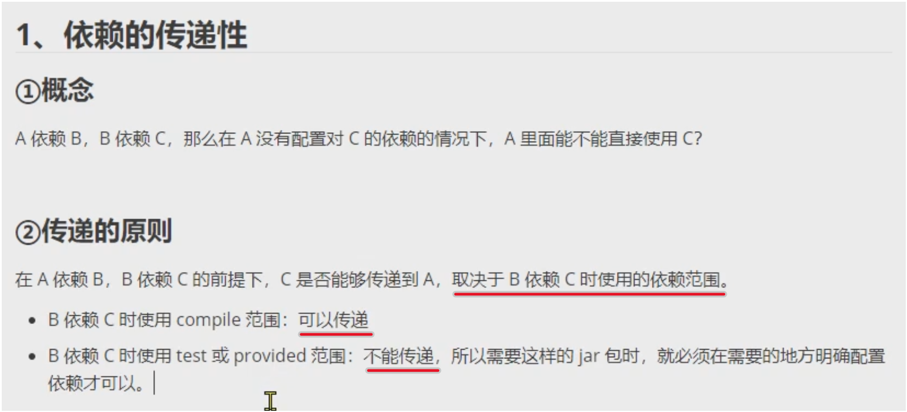

`compile`                          会传递，不会截断
`test` / `provided`                不会传递，会阶段

`mvn dependency:list`              查看工程实际用到的依赖，被 test/provided 截断的，不会传递过来，即不会列举于此，也不可用
`mvn dependency:tree`              用树形查看工程用到的依赖，无论是compile/test/provided，均会列举出来