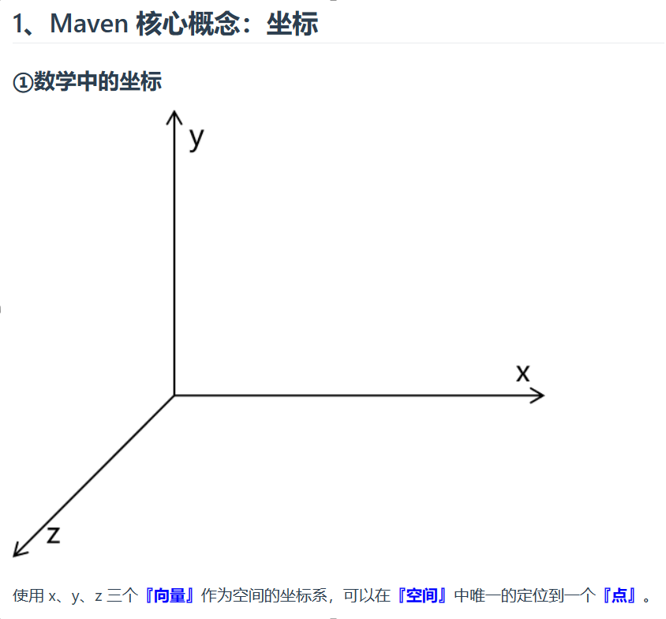
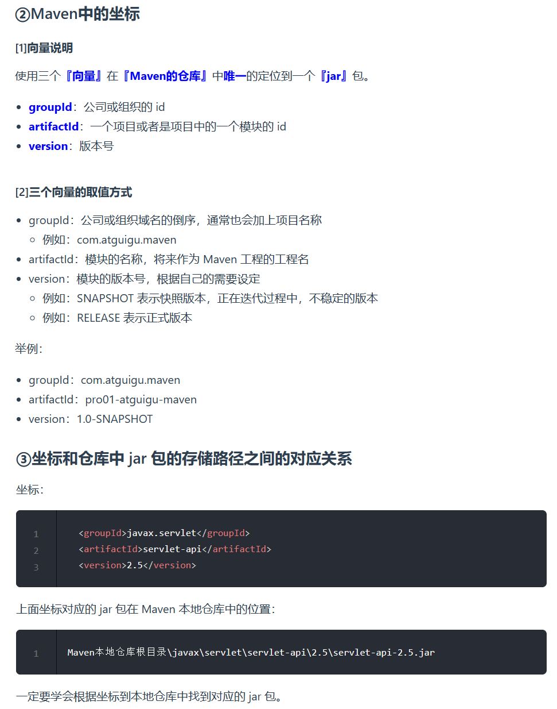
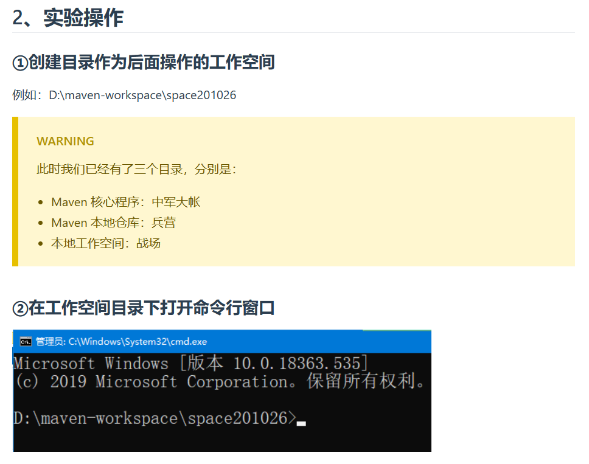
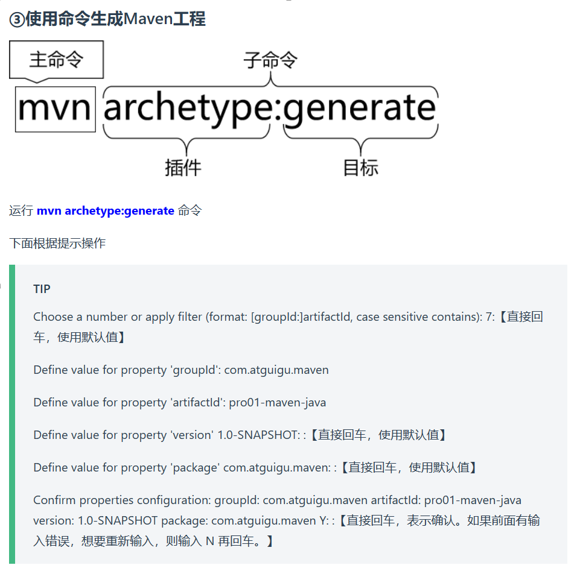
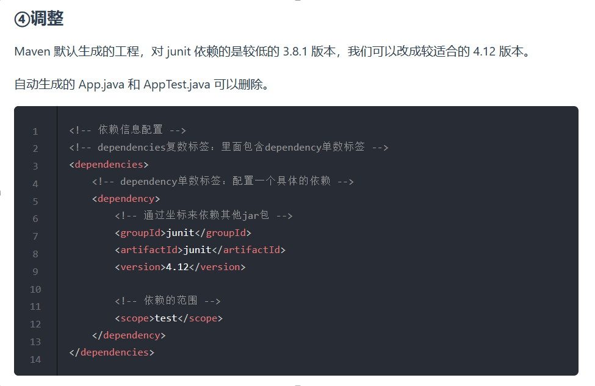
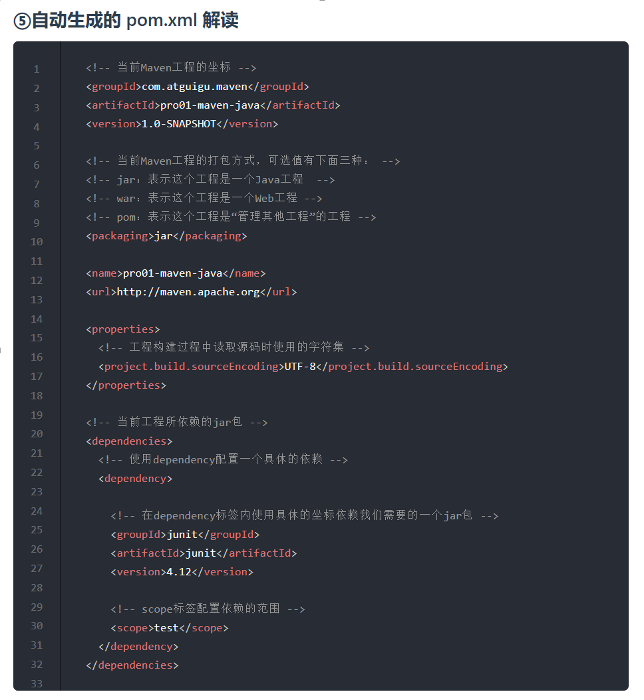
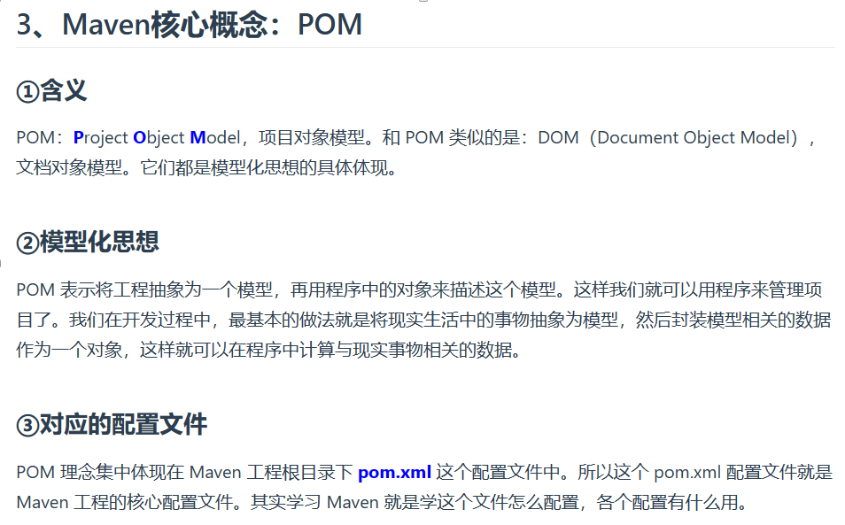
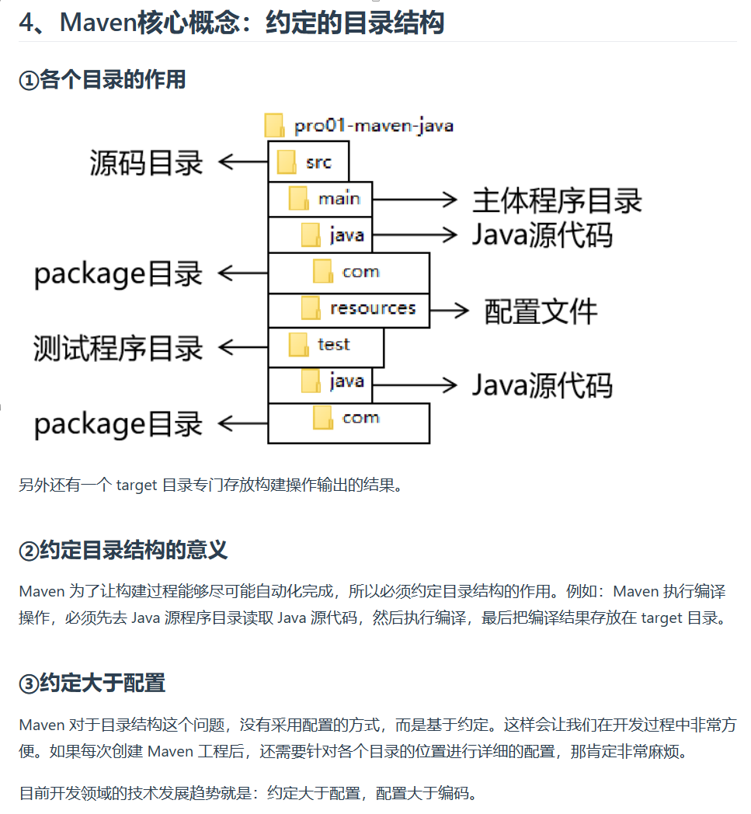

似乎一个 . 的前后 各对应一层文件夹
 

 

 

 

 pom.xml 在生成的 Maven工程 的根目录下
  

 
 

这种目录结构是由  超级pom  决定了，后面所有的pom都要按照这种接口创建。超级pom 是所有pom的父pom

约定 大于 配置      配置 大于 编码                 从 编码 到  配置  再到  约定   这是一个封装越来越深的结果
 