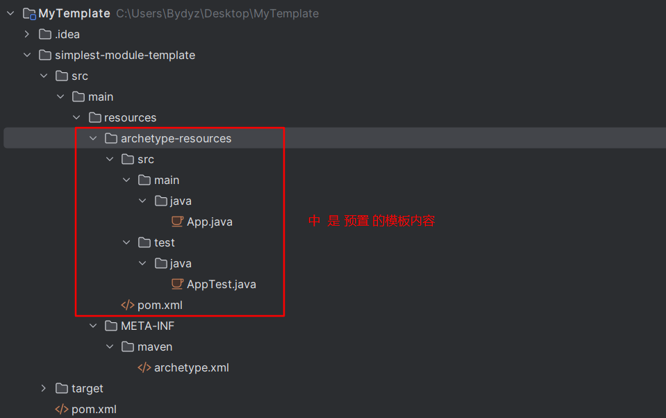
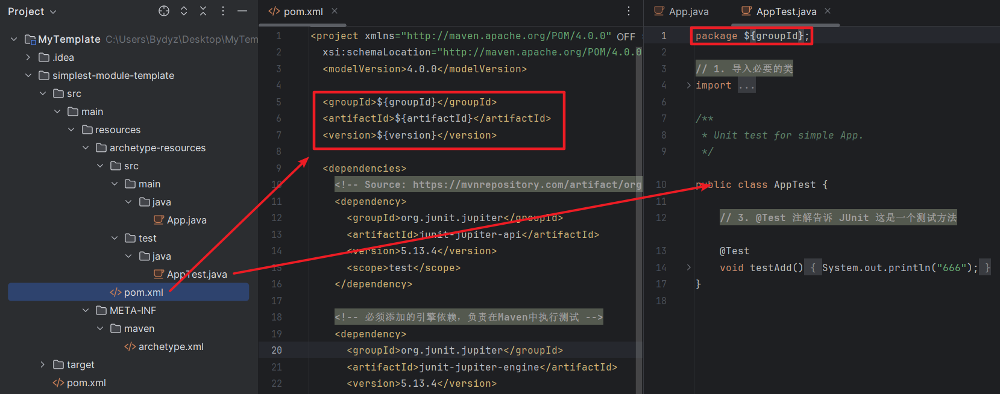

# 最简洁的创建

1. 在一个空文件夹下运行以下 Maven 命令：
    `mvn archetype:generate -DgroupId=org.rc -DartifactId=simplest-module-template -Dversion=1.0 -DarchetypeArtifactId=maven-archetype-archetype -DinteractiveMode=false`

    执行后，它会创建一个名为 `simplest-module-template` 的文件夹，这就是你用来定义模板的项目。结构如下：

    

2. 修改如下内容，以便后面使用时进行模板替换

    

3. 在 `simplest-module-template`文件夹下，执行 `mvn install`  即创建了 自定义Archetype , 后续即可使用